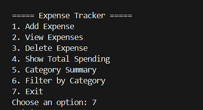
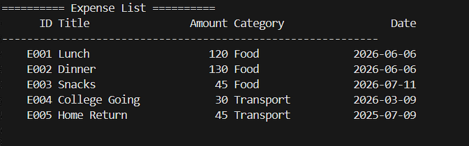
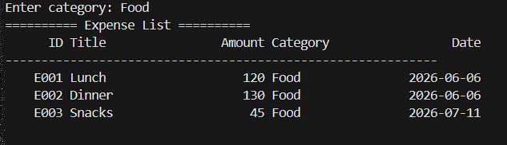

# Expense Tracker CLI

This project started as a simple idea:
*"What if I build a small system that tracks expenses from the terminal?"*

But while building it, it slowly became something more important for me — a **practice ground for learning how real programs are structured**.

Instead of just writing a single script, I tried to approach it the way a developer would approach a real project:

* separating logic into modules
* storing data in files
* designing a CLI interface
* adding analytics
* documenting everything properly

The goal of this project wasn't just to make an expense tracker.
The real goal was to **practice writing clean, structured Python code**.

---

# What This Program Does

This is a **command-line expense tracker** that allows users to record and analyze their spending.

From the terminal you can:

• add expense records
• view all expenses in a formatted table
• delete expenses by ID
• calculate total spending
• analyze spending by category
• filter expenses by category

All data is stored locally using **JSON files**, which makes the system simple but effective.

---

# Why I Built This

I'm currently learning programming seriously and trying to improve my **problem solving and software design skills**.

Instead of only solving coding problems, I wanted to build projects where I could practice things like:

* modular architecture
* file handling
* CLI interface design
* data aggregation
* validation and error handling
* Git commit discipline

This project helped me understand how a program grows step by step from **an idea → to a structured system**.

---

# Features

The current system supports:

• Adding new expenses
• Viewing expenses in a formatted table
• Deleting expenses safely using unique IDs
• Category-based filtering
• Total spending calculation
• Category-wise expense analytics
• Persistent storage using JSON files

Some basic input validation is also implemented to prevent invalid data.

---

# Example CLI Menu

When the program runs, the terminal interface looks like this:

```
===== Expense Tracker =====

1. Add Expense
2. View Expenses
3. Delete Expense
4. Show Total Spending
5. Category Summary
6. Filter by Category
7. Exit
```

The idea was to keep the interface **simple but functional**.

---

# Example Output

Expense records are displayed in a formatted table:

```
========== Expense List ==========

      ID Title               Amount Category           Date
--------------------------------------------------------------
    E001 Lunch                 250  Food          2026-03-10
    E002 Bus Fare               60  Transport     2026-03-10
    E003 Book                  400  Education     2026-03-11
```

Category analytics can also be displayed like this:

```
====== Category Summary ======

Category              Amount
------------------------------
Food                   650
Transport               60
Education              400
```

---

# Project Structure

The project is organized using a modular structure:

```
expense-tracker/
│
├── data/
│   ├── expenses.json
│   └── categories.json
│
├── modules/
│   ├── analytics.py
│   ├── cli.py
│   ├── config_loader.py
│   ├── display.py
│   ├── expense_manager.py
│   └── storage.py
│
├── main.py
└── README.md
```

Each module has a specific responsibility:

| Module          | Purpose                         |
| --------------- | ------------------------------- |
| analytics       | calculates totals and summaries |
| cli             | handles the user interface      |
| storage         | manages file reading/writing    |
| expense_manager | handles expense logic           |
| display         | formats output tables           |

This separation made the code **much easier to manage as the project grew**.

---

# How to Run

Clone the repository and run:

```
python main.py
```

Everything runs locally.
No external dependencies are required.

---

# Things I Practiced While Building This

While building this project I focused on improving:

• Python fundamentals
• writing modular code
• handling structured data
• designing CLI interfaces
• implementing simple analytics logic
• organizing a project for GitHub

It also helped me understand why **clean architecture matters**, even for small programs.

---
## Screenshots
### CLI Menu


### Expense Records


### Category Analytics


# Final Thoughts

This project is part of my learning journey.

It's not meant to be a perfect production system, but it represents an important step for me in learning how to **think like a programmer instead of just writing scripts**.

The next step for me is to build **larger and more ambitious projects**, especially ones involving **data analysis and machine learning**.

If you're reading this and have suggestions or feedback, I'd genuinely appreciate it.

— Rafid 


