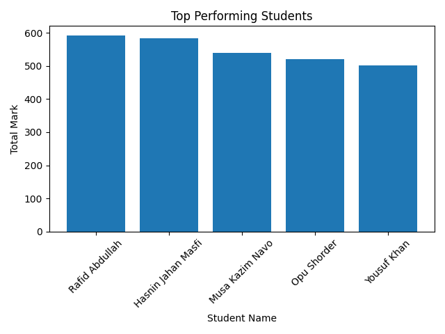
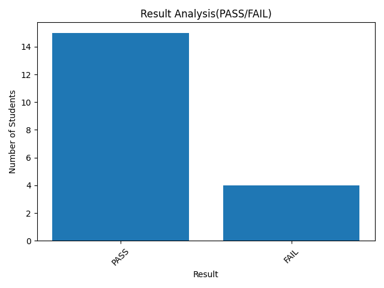
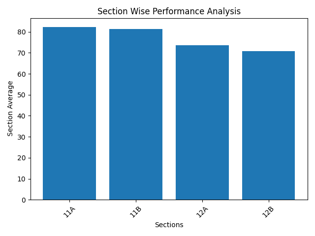
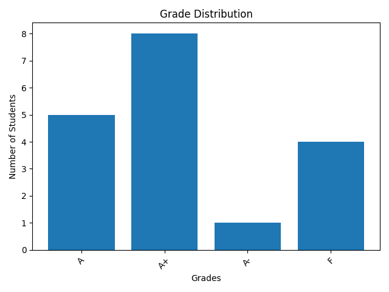

# Student Performance Tracker

## About This Project

This is a small command-line project I built while learning Python. The main idea was to create a simple system that can store student records, analyze their performance, and generate useful reports.

Instead of just saving marks, the program also calculates things like totals, averages, rankings, and different statistics. I also tried to structure the code into multiple modules so that each part of the program has a clear responsibility.

While building it, I practiced working with JSON files, organizing code into modules, validating user input, and generating visualizations using matplotlib.

It’s still a simple CLI application, but building it helped me understand how a slightly larger Python program can be structured.

---
## Project Demo

 


## Features

### Student Management

* Add a new student with marks for multiple subjects
* View detailed student reports
* Edit student information
* Delete student records

### Academic Analytics

The program can calculate several useful statistics:

* Class ranking based on total marks
* Subject toppers
* Overall class topper
* Section-wise average marks
* Section toppers
* Top N students
* Filtering students by section
* Filtering students by pass/fail result

### Data Visualization

Using matplotlib, the system can generate charts such as:

* Top performing students
* Pass vs Fail distribution
* Section performance comparison
* Grade distribution

These charts help visualize class performance instead of just reading numbers.

### Export Feature

The class leaderboard can be exported to a CSV file so it can be opened in spreadsheet software like Excel.

---

## Project Structure

student-performance-tracker/

main.py
config.json

data/
students.json

modules/
analytics.py
student.py
storage.py
display.py
cli.py
export.py
visualize.py
config_loader.py

Reports/

---

## How It Works

Student data is stored in a JSON file.
Each student record includes:

* student ID
* name
* section
* subject marks

When needed, the program loads the data, performs calculations such as totals or averages, and then displays the results in the terminal or generates charts.

I tried to separate the responsibilities of each module. For example:

* the **analytics module** handles calculations
* the **student module** manages student records
* the **display module** prints formatted output
* the **visualize module** creates charts

This made the program easier to manage as it grew.

---

## Requirements

Python 3.x

Python libraries used:

matplotlib

---

## Installation

Clone the repository:

git clone https://github.com/your-username/student-performance-tracker.git

Move into the project folder:

cd student-performance-tracker

Install the required library:

pip install matplotlib

---

## Running the Program

Run the main file:

python main.py

A command-line menu will appear where you can choose different operations like adding students, viewing rankings, or generating charts.

---

## Example Output

Example class ranking:

========== CLASS RANKING ==========

## Rank      ID      Name           Total

```
 1    S102     Rahim           472
 2    S107     Karim           460
 3    S101     Ayesha          455
```

The program can also generate bar charts showing top performers and other statistics.

---

## Example Visualizations

**Top performing students:



**Pass vs Fail distribution:



**Section comparison:



**Grade distribution:

 


## What I Learned

While building this project I practiced:

* organizing Python programs into modules
* working with JSON data files
* validating user input
* calculating statistics
* generating visualizations with matplotlib
* structuring a CLI application

It started as a small idea, but it slowly grew into something much more structured.

---

## Possible Future Improvements

Some ideas I might explore later:

* adding a graphical interface
* using a database instead of JSON
* building a web version
* adding more advanced analytics

For now, this project mainly served as a learning experience while practicing Python programming.   
